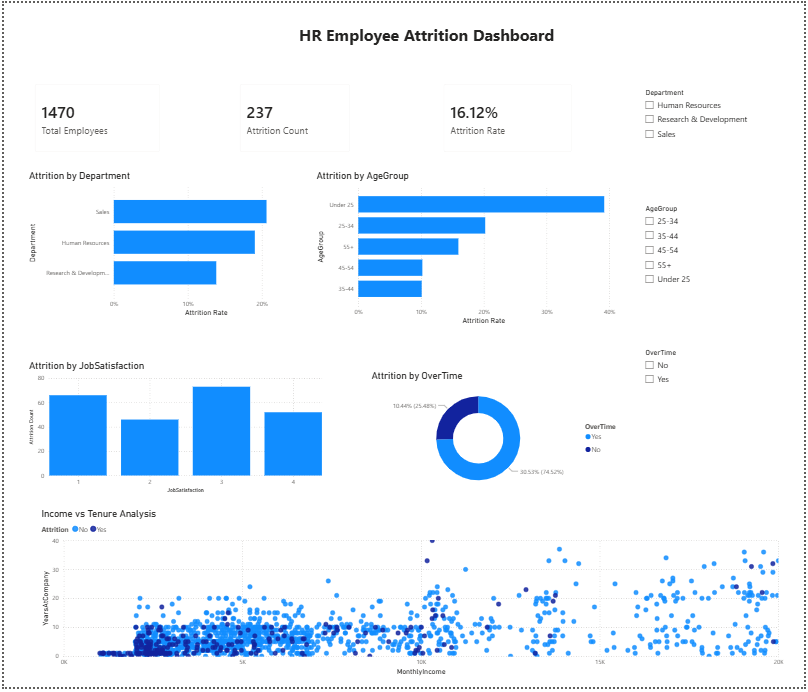

# SCT_DA_3 — HR Employee Attrition Dashboard

## Task Objective
Build an interactive Power BI dashboard to analyze employee attrition and identify key factors influencing employee turnover.

## Dataset
IBM HR Analytics Employee Attrition Dataset

## Tools Used
- Power BI
- DAX
- Data Visualization

## Dashboard Features
- KPI Cards (Total Employees, Attrition Count, Attrition Rate)
- Department-wise Attrition Analysis
- Age Group-wise Attrition Analysis
- Job Satisfaction Analysis
- OverTime Analysis
- Income vs Tenure Scatter Analysis
- Interactive Filters (Department, AgeGroup, OverTime)

## Key Insights
- Sales department has the highest attrition.
- Employees aged 25–34 show the highest turnover.
- Lower job satisfaction is linked to higher attrition.
- Employees working overtime are more likely to leave.
- Lower tenure and lower income employees show higher attrition risk.

## Dashboard Preview
# SCT_DA_3 — HR Employee Attrition Dashboard

## Task Objective
Build an interactive Power BI dashboard to analyze employee attrition and identify key factors influencing employee turnover.

## Dataset
IBM HR Analytics Employee Attrition Dataset

## Tools Used
- Power BI
- DAX
- Data Visualization

## Dashboard Features
- KPI Cards (Total Employees, Attrition Count, Attrition Rate)
- Department-wise Attrition Analysis
- Age Group-wise Attrition Analysis
- Job Satisfaction Analysis
- OverTime Analysis
- Income vs Tenure Scatter Analysis
- Interactive Filters (Department, AgeGroup, OverTime)

## Key Insights
- Sales department has the highest attrition.
- Employees aged 25–34 show the highest turnover.
- Lower job satisfaction is linked to higher attrition.
- Employees working overtime are more likely to leave.
- Lower tenure and lower income employees show higher attrition risk.

## Dashboard Preview
